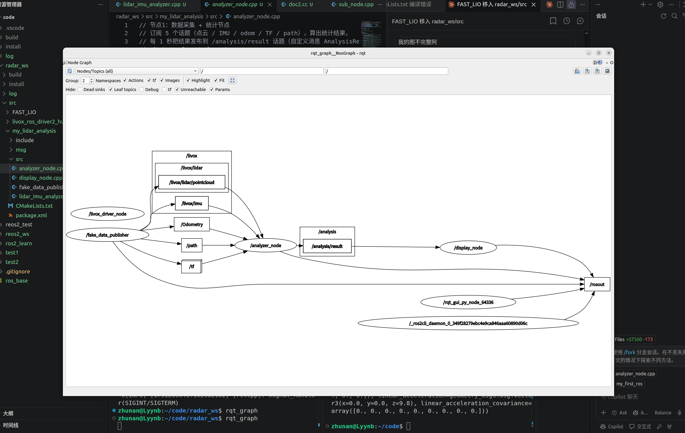
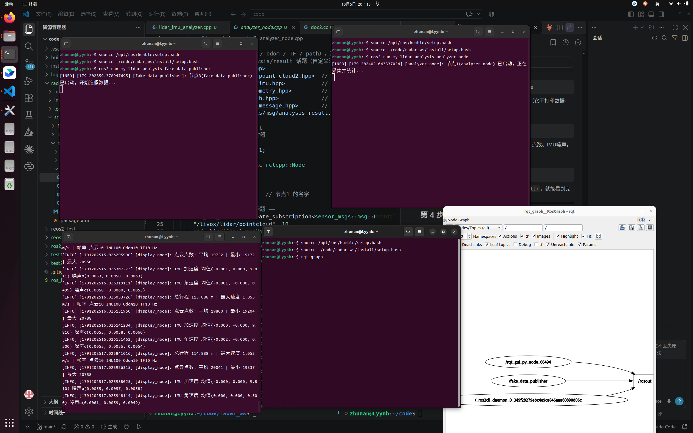

# my_lidar_analysis

雷达数据分析包。用 **3 个节点** 把「采集数据 → 计算统计 → 打印展示」拆开，节点之间用 **1 个自定义消息** 传递结果。没有真实雷达时可以用假数据发布器跑通整个流程。

---

## 1. 系统数据流

```
                  ┌───────────────────────────────────────────────┐
                  │                 原始数据（5 个话题）            │
                  └───────────────────────────────────────────────┘
                                    │
   ┌──────────────────┐            │             ┌──────────────────┐
   │ fake_data_pub    │ ────────►  │  ────────►  │   analyzer_node   │
   │ (假数据发布器)     │   话题1~5   │             │   节点1 采集+统计   │
   └──────────────────┘            │             └────────┬─────────┘
        （真雷达时由               │                      │ 发布自定义消息
         livox + fast_lio          │                      │ /analysis/result
         代替这个节点）            │                      ▼
                                    │             ┌──────────────────┐
                                    │             │   display_node   │
                                    │             │   节点2 打印展示   │
                                    │             └──────────────────┘
```

一句话概括：

1. **数据源**：`fake_data_publisher` 发布 5 个假数据话题（真雷达模式下由 livox 驱动 + FAST_LIO 发布）。
2. **节点1** `analyzer_node`：订阅这 5 个话题，每秒统计一次，把结果打包成自定义消息发布到 `/analysis/result`。
3. **节点2** `display_node`：订阅 `/analysis/result`，把统计结果打印到终端。

**数据流截图（rqt_graph）：**



---

## 2. 用到的 Topic

| 话题 | 消息类型 | 方向 | 频率(假数据) | 说明 |
|------|----------|------|--------------|------|
| `/livox/lidar/pointcloud` | `sensor_msgs/msg/PointCloud2` | 发布者→节点1 | 10 Hz | 雷达点云，每帧约 20000 点 |
| `/livox/imu` | `sensor_msgs/msg/Imu` | 发布者→节点1 | 100 Hz | IMU 加速度/角速度（含重力+噪声） |
| `/Odometry` | `nav_msgs/msg/Odometry` | 发布者→节点1 | 10 Hz | 里程计位姿，用来算总行程和速度 |
| `/tf` | `tf2_msgs/msg/TFMessage` | 发布者→节点1 | 10 Hz | 坐标变换 |
| `/path` | `nav_msgs/msg/Path` | 发布者→节点1 | 10 Hz | 走过的轨迹 |
| `/analysis/result` | `my_lidar_analysis/msg/AnalysisResult` | 节点1→节点2 | 1 Hz | 统计结果（自定义消息） |

自定义消息 `AnalysisResult` 的字段：

| 字段 | 含义 |
|------|------|
| `total_distance` | 总行程（累计，米） |
| `max_speed` | 最大速度（累计，米/秒） |
| `cloud_hz` / `imu_hz` / `odom_hz` / `tf_hz` | 四种数据各自的帧率（Hz） |
| `avg_points` / `min_points` / `max_points` | 点云每帧点数的平均/最小/最大 |
| `imu_mean[6]` / `imu_stddev[6]` | IMU 均值与噪声σ（下标 0-2 加速度，3-5 角速度） |

---

## 3. Frame 与 TF 关系

| Frame 名 | 含义 | 用在哪些消息上 |
|----------|------|----------------|
| `camera_init` | 世界/里程计坐标系（原点） | odom 的 `frame_id`、path 的 `frame_id`、TF 的父 frame |
| `body` | 机器人本体坐标系 | IMU 的 `frame_id`、odom 的 `child_frame_id`、TF 的子 frame |
| `livox_frame` | 雷达坐标系 | 点云的 `frame_id` |

**TF 树（假数据模式）：**

```
camera_init ──► body          （每 100ms 发布一次，跟着 odom 走）
   (世界)       (机器人)
```

- 假数据发布器只发布 `camera_init → body` 这一条 TF，机器人沿半径 2m 的圆走。
- 点云的 `livox_frame` 在这里只作为 `frame_id` 标记，假数据模式下没有单独发布 `body → livox_frame` 的 TF。
- 真雷达模式下这些话题由 livox 驱动和 FAST_LIO 发布，坐标系约定一致（FAST_LIO 同样用 `camera_init`/`body`，雷达用 `livox_frame`）。

---

## 4. 编写的节点

| 节点 | 文件 | 功能 |
|------|------|------|
| `analyzer_node` | `src/analyzer_node.cpp` | **节点1**：订阅 5 个原始话题，每秒统计一次（总行程、最大速度、帧率、点数、IMU 均值/噪声σ），发布到 `/analysis/result` |
| `display_node` | `src/display_node.cpp` | **节点2**：订阅 `/analysis/result`，把统计结果打印到终端 |
| `fake_data_publisher` | `src/fake_data_publisher.cpp` | **节点3**：造假数据（点云/IMU/odom/TF/path），让系统没有真雷达也能跑 |

> 另有 `src/lidar_imu_analyzer.cpp` 是最早的**单节点版本**，保留作历史，不参与编译。

---

## 5. 编译 / 启动 / 录制 / 回放

### 5.1 编译

```bash
cd ~/code/radar_ws
colcon build --packages-select my_lidar_analysis
source install/setup.bash
```

### 5.2 启动

**用假数据（默认，推荐先试这个）：**

```bash
ros2 launch my_lidar_analysis system.launch.py
```

**用真雷达（livox + fast_lio）：**

```bash
ros2 launch my_lidar_analysis system.launch.py use_fake_data:=false
```

两种模式下，`analyzer_node` 和 `display_node` 都会启动；`fake_data_publisher` 只在假数据模式启动，真雷达模式下换成 livox 驱动 + FAST_LIO。

**假数据运行效果：**



运行录屏：[假数据运行.webm](media/假数据运行.webm)

### 5.3 录制（把数据存成 rosbag）

```bash
ros2 bag record /livox/lidar/pointcloud /livox/imu /Odometry /tf /path
```

录制结束后，当前目录会生成一个 `rosbag2_年_月_日-时分秒/` 文件夹，里面就是数据。

### 5.4 回放（把录好的数据重放一遍）

```bash
# 先起节点1、节点2，让它们等着接数据
ros2 launch my_lidar_analysis system.launch.py use_fake_data:=false

# 另开一个终端，回放之前录的数据
ros2 bag play <你的bag文件夹名>
```

> 回放时假数据发布器不起作用，数据来自你录的 bag。这样就能用「真雷达录一次，反复回放分析」。

---

## 6. 目录结构

```
my_lidar_analysis/
├── CMakeLists.txt              # 编译配置（3 个可执行文件 + 自定义消息生成）
├── package.xml                 # 包依赖
├── README.md                   # 本文件
├── msg/
│   └── AnalysisResult.msg      # 自定义统计结果消息
├── src/
│   ├── analyzer_node.cpp       # 节点1：采集+统计
│   ├── display_node.cpp        # 节点2：打印
│   ├── fake_data_publisher.cpp # 节点3：假数据
│   └── lidar_imu_analyzer.cpp  # （历史）单节点版本
├── media/
│   ├── 数据流.png              # 数据流截图（rqt_graph）
│   ├── 假数据运行.png          # 假数据运行截图
│   └── 假数据运行.webm          # 运行录屏
└── launch/
    └── system.launch.py        # 一键启动，可切换假数据/真雷达
```


用到AI情况说明
这次任务我采取了先用虚假数据测试 再 导入真实数据运行的大概思路
借助AI帮我构建了代码语句
但终端运行操作与实际实践每有用AI 生成