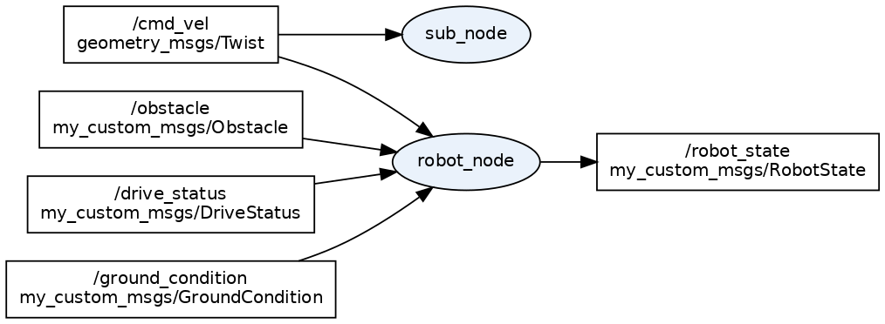

# reos2_test —— 简单差分驱动机器人（ROS 2）

一个基于 **ROS 2 Humble** 的差分驱动机器人示例，重点演示：

- 速度指令处理（限幅 + 差分驱动逆解算）
- 状态处理与发布（含故障码）
- 安全速度（防打滑 / 防翻车 / 地面摩擦自适应）
- 障碍物分类应对（台阶 / 刚体 / 行人，刚体空洞判断）
- 驱动器异常保护（低压 / 过热 / 堵转 / 驱动器故障）
- 指令看门狗（消息积压导致的过时指令问题）

---

## 1. 系统结构

```
                     ┌─────────────────┐
                     │  遥操作 / 规划    │  (外部，本仓库未实现)
                     └────────┬────────┘
                              │  /cmd_vel (geometry_msgs/Twist)
                              ▼
┌───────────────┐   /obstacle      ┌─────────────────────┐   /drive_status   ┌───────────────┐
│ 感知节点(外部) │ ───────────────► │                     │ ◄──────────────── │ 电机驱动器(外部)│
│ 激光/视觉/超声 │                 │     robot_node      │                   │ 电压/温度/堵转  │
└───────────────┘                 │   (核心机器人节点)    │                   └───────────────┘
┌───────────────┐   /ground_condition                     │
│ 视觉/IMU(外部) │ ───────────────► │  差分驱动逆解算+安全   │
│ 地面纹理/摩擦  │                 │  状态/故障/报警        │
└───────────────┘                 └───────────┬──────────┘
                                              │  /robot_state (my_custom_msgs/RobotState)
                                              ▼
                                   ┌─────────────────────┐
                                   │ 上层监控 / 可视化    │  (外部)
                                   └─────────────────────┘
```



**数据流一句话**：外部节点把速度指令（`/cmd_vel`）、障碍物（`/obstacle`）、驱动器状态（`/drive_status`）、地面状态（`/ground_condition`）发给 `robot_node`，`robot_node` 做限幅 + 安全约束 + 差分逆解算，把实际运动状态（`/robot_state`）发布给上层监控。

> 仓库内只实现了 `robot_node` 和两个教程节点（`sub_node`、`pub_node`）；四个"外部"节点是数据来源，需自行提供（或用 `ros2 topic pub` 手动模拟，见文末示例）。

---

## 2. 目录结构

```
reos2_test/
├── src/
│   ├── my_custom_msgs/          # 自定义消息
│   │   └── msg/
│   │       ├── SensorReading.msg     # 传感器采样（示例）
│   │       ├── RobotState.msg        # 机器人状态
│   │       ├── Obstacle.msg          # 前方障碍物
│   │       ├── DriveStatus.msg       # 驱动器健康/异常状态
│   │       └── GroundCondition.msg   # 地面摩擦/纹理状态
│   └── my_first_ros/            # 节点与 launch
│       ├── src/
│       │   ├── robot_node.cpp   # 机器人主节点（核心）
│       │   ├── sub_node.cpp     # 订阅 /cmd_vel 打印（示例）
│       │   └── pub_node.cpp     # 发布 /chatter（示例，未纳入 launch）
│       └── launch/
│           └── robot.launch.py  # 一键启动
```

---

## 3. 环境要求与编译

```bash
# 环境：Ubuntu 22.04 + ROS 2 Humble
cd ~/code/reos2_test
source /opt/ros/humble/setup.bash
colcon build --base-paths src
```

> `--base-paths src`：只编译 `src/` 下的包，避免把工作区根目录也当作包扫描。

---

## 4. 运行

```bash
source /opt/ros/humble/setup.bash
source install/setup.bash

# 一键启动 robot_node + sub_node
ros2 launch my_first_ros robot.launch.py

# 覆盖关键参数
ros2 launch my_first_ros robot.launch.py max_linear:=0.8 friction_coeff:=0.3

# 或单独运行
ros2 run my_first_ros robot_node
```

---

## 5. 节点职责

| 节点 | 职责 | 是否纳入 launch |
|---|---|---|
| **robot_node** | 核心：速度指令限幅 → 障碍物/驱动器/地面安全约束 → 防打滑防翻斜坡 → 差分逆解算 → 状态发布；含看门狗与电池模拟 | ✅ |
| **sub_node** | 示例：订阅 `/cmd_vel`，打印收到的线速度/角速度，用于观察指令是否送达 | ✅ |
| **pub_node** | 示例：周期发布 `/chatter` 字符串，验证话题发布 | ❌（可手动 `ros2 run`） |

---

## 6. 话题（输入 / 输出）

### robot_node

| 方向 | 话题 | 类型 | 用途 |
|---|---|---|---|
| 输入 | `/cmd_vel` | `geometry_msgs/Twist` | 速度指令（QoS：KeepLast(1)+BestEffort） |
| 输入 | `/obstacle` | `my_custom_msgs/Obstacle` | 前方障碍物（类型/距离/高度/空洞） |
| 输入 | `/drive_status` | `my_custom_msgs/DriveStatus` | 驱动器电压/温度/堵转/故障 |
| 输入 | `/ground_condition` | `my_custom_msgs/GroundCondition` | 地面摩擦系数 μ |
| 输出 | `/robot_state` | `my_custom_msgs/RobotState` | 实际速度/轮速/电量/状态/报警/故障 |

### 其余节点

| 节点 | 方向 | 话题 | 类型 |
|---|---|---|---|
| sub_node | 输入 | `/cmd_vel` | `geometry_msgs/Twist` |
| pub_node | 输出 | `/chatter` | `std_msgs/String` |

---

## 7. 自定义消息

**Obstacle.msg**

```msg
uint8   type       # 0=台阶(小,可跨越) 1=大型障碍(刚体) 2=行人
float32 distance   # 到障碍物距离 (m)
float32 height     # 障碍物高度 (m)
bool    valid      # 数据是否有效
bool    has_gap    # 中间是否有可穿过的空洞
float32 gap_width  # 空洞宽度 (m)
```

**DriveStatus.msg**

```msg
float32 voltage       # 母线电压 (V)
float32 temperature   # 温度 (℃)
bool    stall         # 是否堵转
bool    driver_fault  # 驱动器是否报故障
bool    valid
```

**GroundCondition.msg**

```msg
float32 friction_coeff  # 摩擦系数 μ（0~1，越小越光滑）
bool    valid
```

**RobotState.msg**

```msg
float32 vx            # 前进速度 (m/s)
float32 wz            # 角速度 (rad/s)
float32 left_wheel    # 左轮角速度 (rad/s)
float32 right_wheel   # 右轮角速度 (rad/s)
float32 battery       # 电池电量 (%)
uint8   status        # 0=待机 1=运行 2=低电量告警
bool    alarm         # 是否报警
uint8   fault         # 故障位：bit0=低压 bit1=过热 bit2=堵转 bit3=驱动器
```

**SensorReading.msg**（示例）

```msg
uint32 seq
float32 value
bool valid
```

---

## 8. 关键参数

`robot_node` 最常用、最需要按实车调整的参数：

| 参数 | 默认值 | 说明 |
|---|---|---|
| `max_linear` | 0.50 | 最大线速度 (m/s) |
| `max_angular` | 1.00 | 最大角速度 (rad/s) |
| `max_linear_accel` | 1.00 | 最大线加速度 (m/s²)，防打滑 |
| `max_angular_accel` | 2.00 | 最大角加速度 (rad/s²) |
| `wheel_radius` / `wheel_base` | 0.05 / 0.20 | 轮半径 / 左右轮间距 (m)，逆解算用 |
| `cg_height` | 0.15 | 重心离地高度 (m)，反推防侧翻阈值 |
| `stop_distance` / `slow_distance` | 0.15 / 0.50 | 障碍物停车 / 减速距离 (m) |
| `vehicle_width` | 0.30 | 车宽 (m)，判断能否穿过空洞 |
| `undervoltage_critical` | 20.0 | 低压硬停车阈值 (V) |
| `overtemp_critical` | 80.0 | 过热硬停车阈值 (℃) |
| `friction_coeff` | 0.60 | 地面摩擦系数 μ（0~1） |
| `cmd_timeout` | 0.5 | 指令超时时间 (s)，看门狗 |

**完整参数列表**（其余按需修改）：

| 参数 | 默认值 | 说明 |
|---|---|---|
| `battery_drain` | 0.02 | 运动时每秒耗电 (%) |
| `rollover_safety_factor` | 0.50 | 防侧翻安全系数（<1） |
| `max_wheel_speed` | 20.0 | 轮子机械极限转速 (rad/s) |
| `control_rate` | 50.0 | 速度控制环频率 (Hz) |
| `emergency_brake_distance` | 0.30 | 行人紧急制动距离 (m) |
| `collision_distance` | 0.10 | 行人来不及制动→转向距离 (m) |
| `turn_direction` | 1 | 转向方向（+1 左转 / -1 右转） |
| `clearance_margin` | 0.10 | 通过空洞所需总余量 (m) |
| `gap_pass_speed` | 0.20 | 穿洞限速 (m/s) |
| `undervoltage_warn` | 22.0 | 低压告警阈值 (V) |
| `overtemp_warn` | 60.0 | 过热告警阈值 (℃) |
| `traction_margin` | 0.80 | 附着安全系数（<1） |
| `braking_distance` | 0.15 | 安全制动距离 (m) |

---

## 9. 安全功能说明

### 安全速度（防打滑 / 防翻车）

实际速度以 `max_linear_accel` / `max_angular_accel` 斜坡逼近目标，避免速度突变打滑。

- **防侧翻**：`|vx·wz|` 超过 `rollover_safety_factor × 9.81 × (轮距/2) / 重心高` 时压低角速度。
- **机械极限**：轮速钳制在 `max_wheel_speed` 以内。

### 障碍物分类应对

| 障碍物 | 处理 |
|---|---|
| 台阶（小，如 20cm） | 直接跳跃越过，不减速 |
| 大型刚体（实心） | ≤`stop_distance` 停车；否则按距离减速 |
| 大型刚体（有空洞） | 空洞 ≥ 车宽+余量 → 减速通过；否则绕开 |
| 行人 | 过近紧急制动+报警；来不及制动 → 转向绕开 |

### 驱动器异常保护

| 异常 | 告警区 | 临界区 |
|---|---|---|
| 低压 | ≤`undervoltage_warn` 降额运行 | ≤`undervoltage_critical` 硬停车 |
| 过热 | ≥`overtemp_warn` 降额运行 | ≥`overtemp_critical` 硬停车 |
| 堵转 | — | 立即硬停车 |
| 驱动器故障 | — | 立即硬停车 |

### 地面摩擦自适应

按摩擦系数 μ 反推三档约束：最高速 `√(2μg·制动距离)`、加速度 `μg·附着系数`、侧向 `min(翻车阈值, μg·附着系数)`。光滑地面自动降速防打滑/甩尾。

### 指令看门狗

`/cmd_vel` 使用 `KeepLast(1)+BestEffort` 队列，只保留最新指令；超 `cmd_timeout` 未收到新指令自动停车，避免执行积压的过时指令。

---

## 10. 录制与回放（rosbag）

用 rosbag2 录制系统运行数据，之后可脱离真实传感器/遥操作回放复现。

```bash
# —— 录制 ——
ros2 bag record -a                      # 录全部话题
ros2 bag record -o my_bag /cmd_vel /obstacle /drive_status /ground_condition   # 只录输入话题

# —— 查看 ——
ros2 bag info my_bag

# —— 回放 ——
ros2 bag play my_bag                             # 原速回放
ros2 bag play my_bag --rate 0.5                  # 半速
ros2 bag play my_bag --loop                      # 循环
ros2 bag play my_bag --topics /cmd_vel /obstacle # 只回放指定话题
```

已提供示例包：`bags/reos2_test_demo/`（含 `/cmd_vel`、`/obstacle`、`/drive_status`、`/ground_condition` 与 `/robot_state`）。

**注意**：

- `record -a` 靠 DDS 发现话题有约 1 秒延迟，一次性消息可能漏录——先让各话题持续发布、或等录制器订阅完再发数据。
- 回放时若同时运行 robot_node，bag 里的 `/robot_state` 会与节点自身发布冲突——回放只用 `--topics` 选输入话题，或回放时不启动节点。

---

## 附录：手动模拟数据（无外部节点时）

```bash
source install/setup.bash

# 发前进指令
ros2 topic pub -1 /cmd_vel geometry_msgs/msg/Twist "{linear: {x: 0.5}, angular: {z: 0.0}}"

# 发障碍物（大型刚体，0.3m，带 0.5m 空洞）
ros2 topic pub -1 /obstacle my_custom_msgs/msg/Obstacle \
  "{type: 1, distance: 0.3, height: 1.0, valid: true, has_gap: true, gap_width: 0.5}"

# 发驱动器状态（低压 21V）
ros2 topic pub -1 /drive_status my_custom_msgs/msg/DriveStatus \
  "{voltage: 21.0, temperature: 40.0, stall: false, driver_fault: false, valid: true}"

# 发地面状态（光滑地面 μ=0.2）
ros2 topic pub -1 /ground_condition my_custom_msgs/msg/GroundCondition \
  "{friction_coeff: 0.2, valid: true}"

# 查看机器人状态
ros2 topic echo /robot_state
```
